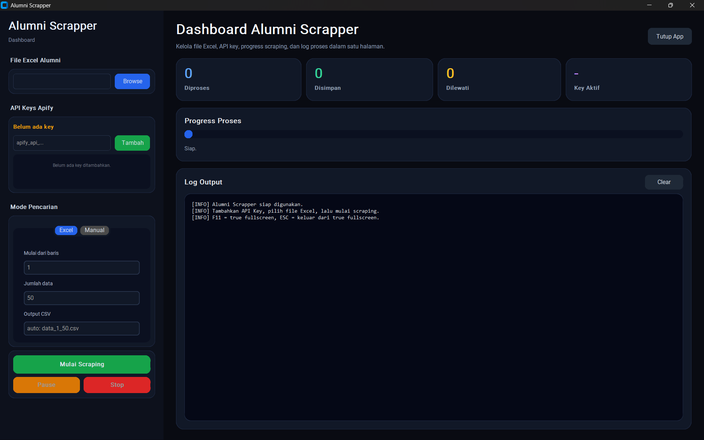

# LinkedIn Alumni Scraper

<p align="left">
  
  
  
  
  
  
</p>

Sistem otomasi untuk melakukan proses scraping data profil LinkedIn secara massal (batch) maupun manual berdasarkan nama alumni. Sistem ini dirancang untuk mencari dan mengklasifikasikan status pekerjaan dan karir alumni Universitas Muhammadiyah Malang secara presisi melalui integrasi Apify API.

---

## Daftar Isi

- [Persyaratan Sistem](#persyaratan-sistem)
- [Cara Mendapatkan API Key Apify](#cara-mendapatkan-api-key-apify)
- [Struktur Proyek](#struktur-proyek)
- [Cara Menjalankan Aplikasi](#cara-menjalankan-aplikasi)
  - [Menggunakan GUI](#1-menggunakan-gui-direkomendasikan)
  - [Menggunakan CLI](#2-menggunakan-cli-tanpa-gui)
- [Konfigurasi](#konfigurasi)
- [Format Output CSV](#format-output-csv)
- [Fitur Utama](#fitur-utama)

---

## Persyaratan Sistem

Pastikan sistem Anda telah terinstal:

- Python **3.10** atau versi yang lebih baru
- pip (Python package manager)

Instal semua dependensi dengan satu perintah:

```bash
pip install -r requirements.txt
```

Dependensi yang diinstal meliputi:

| Paket | Fungsi |
|---|---|
| `customtkinter` | Framework GUI modern berbasis Tkinter |
| `pandas` | Membaca dan memproses file Excel |
| `openpyxl` | Engine pembaca file `.xlsx` |
| `apify-client` | Client resmi untuk mengakses Apify API |

---

## Cara Mendapatkan API Key Apify

Sistem ini menggunakan layanan [Apify](https://apify.com) sebagai mesin pencari profil LinkedIn.

1. Kunjungi [console.apify.com](https://console.apify.com/) dan buat akun (tersedia plan gratis).
2. Setelah masuk ke _dashboard_, buka menu **Settings** di panel kiri bawah.
3. Pilih tab **Integrations**, lalu temukan bagian **API tokens**.
4. Klik **Copy** untuk menyalin token rahasia Anda.
5. Tempel token tersebut pada kolom **API Keys Apify** di aplikasi, lalu klik **Tambah**.

> Token Anda akan tersimpan otomatis ke file `api_keys.json` secara lokal dan dimuat kembali setiap kali aplikasi dibuka.

---

## Struktur Proyek

```
scrape-1/
|
|-- gui.py                  # Entry point antarmuka GUI (CustomTkinter)
|-- main.py                 # Entry point antarmuka CLI (Terminal)
|-- run.py                  # Script runner alternatif
|-- config.py               # Konfigurasi global (nama file, actor Apify, dll)
|-- requirements.txt        # Daftar dependensi Python
|-- api_keys.json           # Daftar API Key tersimpan (diabaikan git)
|-- checkpoint.json         # State checkpoint sesi terakhir (diabaikan git)
|-- README.md
|-- .gitignore
|
|-- core/                   # Modul logika inti
|   |-- api_manager.py      # Manajemen dan rotasi otomatis API Key
|   |-- apify_service.py    # Pemanggilan Apify actor & retry logic
|   |-- checkpoint.py       # Simpan & muat state checkpoint
|
|-- modes/                  # Mode jalankan scraping
|   |-- mode_excel.py       # Scraping massal dari file Excel
|   |-- mode_manual.py      # Pencarian manual satu nama via CLI
|
|-- utils/                  # Utilitas pendukung
|   |-- data_extractor.py   # Ekstraksi & transformasi data hasil Apify
|   |-- classifier.py       # Klasifikasi status pekerjaan alumni
|   |-- name_utils.py       # Pemisahan nama depan dan nama belakang
```

---

## Cara Menjalankan Aplikasi

### 1. Menggunakan GUI (Direkomendasikan)

Menyediakan antarmuka visual lengkap dengan pemantauan log real-time, progress bar, dan manajemen kunci API.

```bash
python gui.py
```

<p align="center">
  
</p>

**Panduan Penggunaan GUI:**

1. **File Excel Alumni** — Klik tombol **Browse** untuk memilih file `.xlsx` sumber data alumni.
2. **API Keys Apify** — Masukkan token Apify Anda lalu klik **Tambah**. Sistem mendukung lebih dari satu key untuk rotasi otomatis.
3. **Mode Pencarian** — Pilih tab sesuai kebutuhan:
   - **Excel**: Masukkan baris awal dan jumlah data yang ingin diproses, lalu isi nama file output (opsional).
   - **Manual**: Masukkan nama lengkap alumni yang ingin dicari.
4. Klik **Mulai Scraping**. Gunakan tombol **Pause** untuk menjeda sementara dan **Stop** untuk menghentikan proses sepenuhnya.

**Kontrol Proses:**

| Tombol | Fungsi |
|---|---|
| Mulai Scraping | Memulai proses sesuai mode yang dipilih |
| Pause / Resume | Menjeda sementara dan melanjutkan kembali |
| Stop | Menghentikan proses secara permanen |

---

### 2. Menggunakan CLI (Tanpa GUI)

Cocok untuk penggunaan di server, skrip otomasi, atau lingkungan tanpa tampilan grafis.

```bash
python main.py
```

**Panduan Penggunaan CLI:**

Sistem akan memandu Anda secara interaktif melalui terminal:

1. Memasukkan API Key Apify (jika `api_keys.json` belum berisi data).
2. Memilih mode:
   - **Mode 1**: Scraping massal dari file Excel (`Data Alumni.xlsx`)
   - **Mode 2**: Pencarian manual satu nama
3. Mengisi parameter sesuai mode yang dipilih (baris mulai, jumlah data, atau nama alumni).

---

## Konfigurasi

Semua konfigurasi global proyek terpusat di file `config.py`:

```python
FILE_INPUT      = 'Data Alumni.xlsx'         # File Excel sumber data
API_KEYS_FILE   = 'api_keys.json'            # File penyimpanan API Key
CHECKPOINT_FILE = 'checkpoint.json'          # File state checkpoint
TARGET_UNI      = 'muhammadiyah malang'      # Kata kunci filter universitas
APIFY_ACTOR     = 'harvestapi/linkedin-...'  # ID actor Apify yang digunakan
MAX_RETRIES     = 3                          # Jumlah percobaan ulang saat gagal
MAX_RESULTS     = 10                         # Jumlah hasil Apify per pencarian
```

---

## Format Output CSV

Setiap sesi scraping menghasilkan file `.csv` dengan struktur kolom berikut:

```
Nama Lulusan, NIM, Tahun Masuk, Tanggal Lulus, Fakultas, Program Studi,
Linkedin, Email, Alamat Bekerja,
Tempat Bekerja (Present), Posisi Jabatan (Present), Status Pekerjaan (Present), Sosmed Kantor (Present),
Tempat Bekerja (Terakhir), Posisi Jabatan (Terakhir), Status Pekerjaan (Terakhir), Sosmed Kantor (Terakhir),
Instagram, TikTok, Facebook, Nomor HP
```

**Contoh baris output (data fiktif):**

```csv
Nama Lulusan,NIM,Tahun Masuk,Tanggal Lulus,Fakultas,Program Studi,Linkedin,Email,Alamat Bekerja,Tempat Bekerja (Present),Posisi Jabatan (Present),Status Pekerjaan (Present),Sosmed Kantor (Present),Tempat Bekerja (Terakhir),Posisi Jabatan (Terakhir),Status Pekerjaan (Terakhir),Sosmed Kantor (Terakhir),Instagram,TikTok,Facebook,Nomor HP
John Doe,201910001,2019,2023,Teknik,Informatika,https://linkedin.com/in/johndoe,john@email.com,Jakarta Raya,PT Teknologi Nusantara,Software Engineer,Bekerja Sesuai Bidang,https://linkedin.com/company/teknologi-nusantara,PT Startup Maju,Junior Developer,Bekerja Sesuai Bidang,https://linkedin.com/company/startup-maju,Tidak publik,Tidak publik,Tidak publik,Tidak publik
Jane Smith,201910002,2019,2023,Bisnis,Manajemen,https://linkedin.com/in/janesmith,Tidak publik,Surabaya,Bank Central Asia,Management Trainee,Bekerja Sesuai Bidang,https://linkedin.com/company/bca,Tidak dicantumkan,Tidak dicantumkan,Belum Pernah Bekerja,Tidak dicantumkan,Tidak publik,Tidak publik,Tidak publik,Tidak publik
```

**Keterangan kolom penting:**

| Kolom | Keterangan |
|---|---|
| Status Pekerjaan | Diklasifikasikan otomatis: `Bekerja Sesuai Bidang`, `Melanjutkan Pendidikan`, `Tidak Ada Pekerjaan Aktif`, dll |
| Present vs Terakhir | Sistem membedakan pekerjaan yang masih aktif dan yang sudah ditinggalkan |
| Tidak publik | Informasi yang tidak dipublikasikan oleh target di LinkedIn |
| Tidak dicantumkan | Kolom yang tidak memiliki data sama sekali pada profil |

---

## Fitur Utama

- **Auto-Rotate API Key** — Jika saldo satu API Key habis, sistem secara otomatis berpindah ke key berikutnya tanpa menghentikan proses.
- **Simpan API Key Otomatis** — Key yang ditambahkan tersimpan ke `api_keys.json` dan dimuat otomatis saat aplikasi dibuka kembali.
- **Pause & Resume** — Proses scraping dapat dijeda sementara dan dilanjutkan kembali kapan saja.
- **Stop Permanen** — Menghentikan proses sepenuhnya sambil tetap menyimpan data yang sudah berhasil dikumpulkan.
- **Log Real-Time** — Seluruh aktivitas scraping (per baris, per nama) ditampilkan langsung di panel Log Output GUI.
- **Progress Bar** — Indikator visual persentase kemajuan dan statistik ringkasan (diproses, disimpan, dilewati).
- **Filter Universitas** — Hanya menyimpan data profil yang terdeteksi memiliki riwayat Universitas Muhammadiyah Malang (dapat dinonaktifkan).
